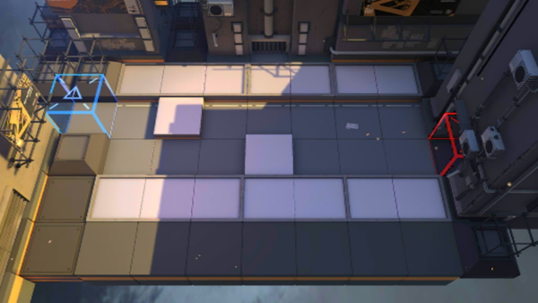

# 关卡一览————0-1

## 关卡一览

关卡编号: 0-1

关卡名称: 坍塌

目标点生命值: 20

敌人总数: 11

理智消耗: 6

## 关卡地图

## 敌人情况

| 敌人图片 | 敌人名称 | 数量  |
|---------|-----|-----|
| ./eneIcons/eneIcons/Ê¿±ø.png| 士兵  |   1  |
| ./eneIcons/eneIcons/Դʯ³æ.png| 源石虫  |   10  |
