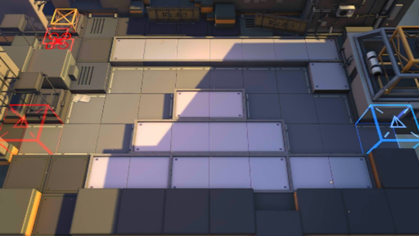

# 关卡一览————0-4

## 关卡一览

关卡编号: 0-4

关卡名称: 混战

目标点生命值: 15

敌人总数: 24

理智消耗: 6

## 关卡地图

## 敌人情况

| 敌人图片 | 敌人名称 | 数量  |
|---------|-----|-----|
| ./eneIcons/eneIcons/±©Í½.png| 暴徒  |   3  |
| ./eneIcons/eneIcons/Ñý¹Ö.png| 妖怪  |   5  |
| ./eneIcons/eneIcons/Դʯ³æ.png| 源石虫  |   16  |
