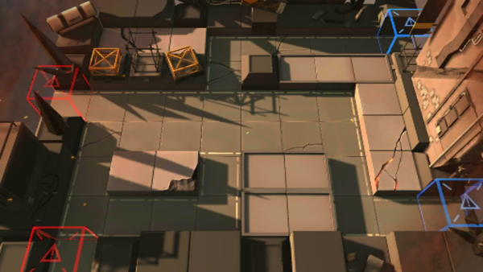

# 关卡一览————1-10

## 关卡一览

关卡编号: 1-10

关卡名称: 残留

目标点生命值: 8

敌人总数: 49

理智消耗: 9

## 关卡地图

## 敌人情况

| 敌人图片 | 敌人名称 | 数量  |
|---------|-----|-----|
| ./eneIcons/eneIcons/»ú¶¯¶Ü±ø.png| 机动盾兵  |   1  |
| ./eneIcons/eneIcons/¼¦Î²¾ÆͶÖÀÕß.png| 鸡尾酒投掷者  |   11  |
| ./eneIcons/eneIcons/ÁÔ¹·.png| 猎狗  |   3  |
| ./eneIcons/eneIcons/Ê°»ÄÕß.png| 拾荒者  |   2  |
| ./eneIcons/eneIcons/Ê¿±ø.png| 士兵  |   10  |
| ./eneIcons/eneIcons/Դʯ³æ.png| 源石虫  |   13  |
| ./eneIcons/eneIcons/Դʯ³æ¡¤¦Á.png| 源石虫·α  |   9  |
