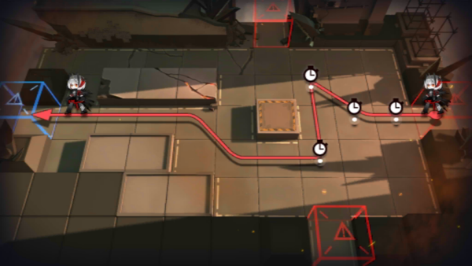

# 关卡一览————1-11

## 关卡一览

关卡编号: 1-11

关卡名称: 遗忘

目标点生命值: 8

敌人总数: 45

理智消耗: 0

## 关卡地图

## 敌人情况

| 敌人图片 | 敌人名称 | 数量  |
|---------|-----|-----|
| ./eneIcons/eneIcons/W(µÐ·½).png| W(敌方)  |   1  |
| ./eneIcons/eneIcons/±©Í½.png| 暴徒  |   8  |
| ./eneIcons/eneIcons/¼¦Î²¾ÆͶÖÀÕß.png| 鸡尾酒投掷者  |   4  |
| ./eneIcons/eneIcons/ÁÔ¹·.png| 猎狗  |   2  |
| ./eneIcons/eneIcons/ÁÔ¹·pro.png| 猎狗pro  |   12  |
| ./eneIcons/eneIcons/Ê¿±ø.png| 士兵  |   15  |
| ./eneIcons/eneIcons/Ë«³Ö½£Ê¿.png| 双持剑士  |   3  |
