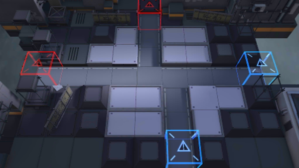

# 关卡一览————1-1

## 关卡一览

关卡编号: 1-1

关卡名称: 孤岛

目标点生命值: 10

敌人总数: 33

理智消耗: 6

## 关卡地图

## 敌人情况

| 敌人图片 | 敌人名称 | 数量  |
|---------|-----|-----|
| ./eneIcons/eneIcons/±©Í½.png| 暴徒  |   2  |
| ./eneIcons/eneIcons/¼¦Î²¾ÆͶÖÀÕß.png| 鸡尾酒投掷者  |   2  |
| ./eneIcons/eneIcons/ÁÔ¹·.png| 猎狗  |   2  |
| ./eneIcons/eneIcons/ÁÔ¹·pro.png| 猎狗pro  |   2  |
| ./eneIcons/eneIcons/Ê°»ÄÕß.png| 拾荒者  |   3  |
| ./eneIcons/eneIcons/Դʯ³æ¡¤¦Á.png| 源石虫·α  |   22  |
