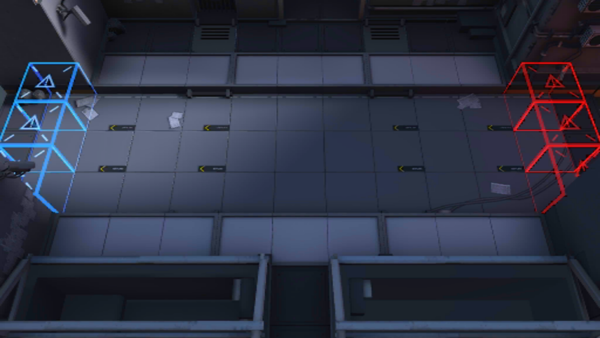

# 关卡一览————1-4

## 关卡一览

关卡编号: 1-4

关卡名称: 先兆

目标点生命值: 10

敌人总数: 39

理智消耗: 6

## 关卡地图

## 敌人情况

| 敌人图片 | 敌人名称 | 数量  |
|---------|-----|-----|
| ./eneIcons/eneIcons/±©Í½.png| 暴徒  |   9  |
| ./eneIcons/eneIcons/»ú¶¯¶Ü±ø.png| 机动盾兵  |   2  |
| ./eneIcons/eneIcons/¼¦Î²¾ÆͶÖÀÕß.png| 鸡尾酒投掷者  |   3  |
| ./eneIcons/eneIcons/Ê°»ÄÕß.png| 拾荒者  |   1  |
| ./eneIcons/eneIcons/Ê¿±ø.png| 士兵  |   4  |
| ./eneIcons/eneIcons/Ñý¹Ö.png| 妖怪  |   3  |
| ./eneIcons/eneIcons/Դʯ³æ¡¤¦Á.png| 源石虫·α  |   17  |
