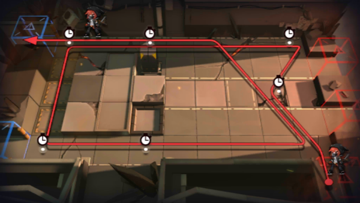

# 关卡一览————1-8

## 关卡一览

关卡编号: 1-8

关卡名称: 意志

目标点生命值: 8

敌人总数: 46

理智消耗: 9

## 关卡地图

## 敌人情况

| 敌人图片 | 敌人名称 | 数量  |
|---------|-----|-----|
| ./eneIcons/eneIcons/»ú¶¯¶Ü±ø.png| 机动盾兵  |   3  |
| ./eneIcons/eneIcons/ÁÔ¹·pro.png| 猎狗pro  |   5  |
| ./eneIcons/eneIcons/Ê¿±ø.png| 士兵  |   8  |
| ./eneIcons/eneIcons/ß±¾ýÕß.png| 弑君者  |   1  |
| ./eneIcons/eneIcons/Êõʦ.png| 术师  |   2  |
| ./eneIcons/eneIcons/Ñý¹Ö.png| 妖怪  |   8  |
| ./eneIcons/eneIcons/Դʯ³æ.png| 源石虫  |   6  |
| ./eneIcons/eneIcons/Դʯ³æ¡¤¦Á.png| 源石虫·α  |   13  |
