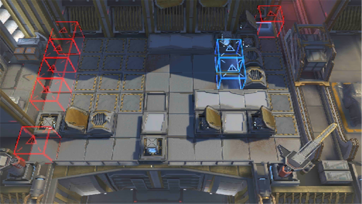

# 关卡一览————10-10

## 关卡一览

关卡编号: 10-10

关卡名称: 旧日之影

目标点生命值: 3

敌人总数: 48

理智消耗: 21

## 关卡地图

## 敌人情况

| 敌人图片 | 敌人名称 | 数量  |
|---------|-----|-----|
| ./eneIcons/eneIcons/´ó¾ýÖ®´¥.png| 大君之触  |   0  |
| ./eneIcons/eneIcons/´ó¾ýÖ®´Í.png| 大君之赐  |   0  |
| ./eneIcons/eneIcons/¿ÊѪµÄ×ÓÒá.png| 渴血的子裔  |   13  |
| ./eneIcons/eneIcons/Èø¿¨×È×ÓÒáÁ´Êõʦ.png| 萨卡兹子裔链术师  |   3  |
| ./eneIcons/eneIcons/Èø¿¨×È×ÓÒáսʿ.png| 萨卡兹子裔战士  |   32  |
