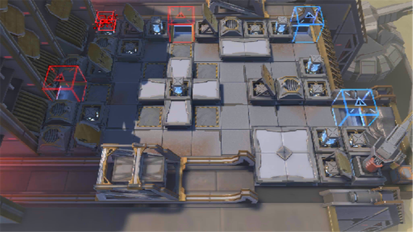

# 关卡一览————10-14

## 关卡一览

关卡编号: 10-14

关卡名称: 瞄准

目标点生命值: 3

敌人总数: 25

理智消耗: 21

## 关卡地图

## 敌人情况

| 敌人图片 | 敌人名称 | 数量  |
|---------|-----|-----|
| ./eneIcons/eneIcons/´ó¾ýÖ®´¥.png| 大君之触  |   0  |
| ./eneIcons/eneIcons/´ó¾ýÖ®´Í.png| 大君之赐  |   0  |
| ./eneIcons/eneIcons/Èø¿¨×ÈÕ÷Óù¤³ÌÎÞÈË»ú.png| 萨卡兹征用工程无人机  |   6  |
| ./eneIcons/eneIcons/Èø¿¨×È×ÓÒἯºÞÕß.png| 萨卡兹子裔集恨者  |   4  |
| ./eneIcons/eneIcons/Èø¿¨×È×ÓÒáսʿ.png| 萨卡兹子裔战士  |   15  |
