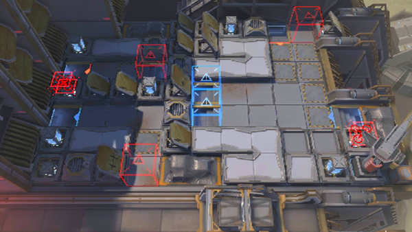

# 关卡一览————10-15

## 关卡一览

关卡编号: 10-15

关卡名称: 逃离炮火

目标点生命值: 3

敌人总数: 29

理智消耗: 24

## 关卡地图

## 敌人情况

| 敌人图片 | 敌人名称 | 数量  |
|---------|-----|-----|
| ./eneIcons/eneIcons/´ó¾ýÖ®´¥.png| 大君之触  |   0  |
| ./eneIcons/eneIcons/´ó¾ýÖ®´Í.png| 大君之赐  |   10  |
| ./eneIcons/eneIcons/Èø¿¨×ÈÕ÷Óù¤³ÌÎÞÈË»ú.png| 萨卡兹征用工程无人机  |   4  |
| ./eneIcons/eneIcons/Èø¿¨×È×ÓÒá²¹¸ø³µ.png| 萨卡兹子裔补给车  |   3  |
| ./eneIcons/eneIcons/Èø¿¨×È×ÓÒáսʿ.png| 萨卡兹子裔战士  |   12  |
