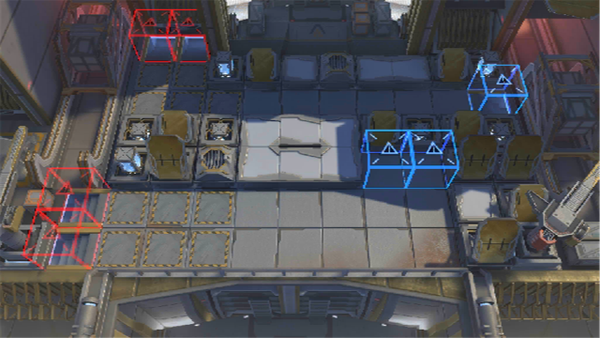

# 关卡一览————10-4

## 关卡一览

关卡编号: 10-4

关卡名称: 鸣铳示警

目标点生命值: 3

敌人总数: 59

理智消耗: 21

## 关卡地图

## 敌人情况

| 敌人图片 | 敌人名称 | 数量  |
|---------|-----|-----|
| ./eneIcons/eneIcons/´ó¾ýÖ®´¥.png| 大君之触  |   0  |
| ./eneIcons/eneIcons/Èø¿¨×ÈÍõÍ¥¾üսʿ.png| 萨卡兹王庭军战士  |   24  |
| ./eneIcons/eneIcons/Èø¿¨×È×ÓÒáսʿ.png| 萨卡兹子裔战士  |   17  |
| ./eneIcons/eneIcons/Éî³Ø¾Ñ»÷ÊÖ.png| 深池狙击手  |   8  |
| ./eneIcons/eneIcons/Éî³ØÕì²ì±ø.png| 深池侦察兵  |   10  |
