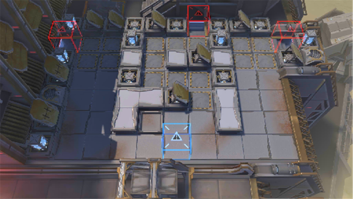

# 关卡一览————10-5

## 关卡一览

关卡编号: 10-5

关卡名称: 城市的呼吸

目标点生命值: 3

敌人总数: 48

理智消耗: 21

## 关卡地图

## 敌人情况

| 敌人图片 | 敌人名称 | 数量  |
|---------|-----|-----|
| ./eneIcons/eneIcons/´ó¾ýÖ®´¥.png| 大君之触  |   0  |
| ./eneIcons/eneIcons/ÈÊ´ÈÖ®´¥.png| 仁慈之触  |   0  |
| ./eneIcons/eneIcons/Èø¿¨×ÈÍõÍ¥¾ü¾«Èñսʿ.png| 萨卡兹王庭军精锐战士  |   3  |
| ./eneIcons/eneIcons/Èø¿¨×È×ÓÒá²¹¸ø³µ.png| 萨卡兹子裔补给车  |   3  |
| ./eneIcons/eneIcons/Èø¿¨×È×ÓÒáսʿ.png| 萨卡兹子裔战士  |   38  |
| ./eneIcons/eneIcons/Èø¿¨×È×ÓÒáսʿ×鳤.png| 萨卡兹子裔战士组长  |   4  |
