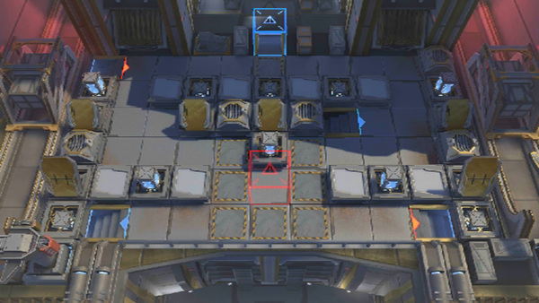

# 关卡一览————10-7

## 关卡一览

关卡编号: 10-7

关卡名称: 痛觉相连

目标点生命值: 3

敌人总数: 53

理智消耗: 24

## 关卡地图

## 敌人情况

| 敌人图片 | 敌人名称 | 数量  |
|---------|-----|-----|
| ./eneIcons/eneIcons/´ó¾ýÖ®´¥.png| 大君之触  |   18  |
| ./eneIcons/eneIcons/Èø¿¨×ÈÍõÍ¥¾üսʿ.png| 萨卡兹王庭军战士  |   11  |
| ./eneIcons/eneIcons/Èø¿¨×È×ÓÒá²¹¸ø³µ.png| 萨卡兹子裔补给车  |   3  |
| ./eneIcons/eneIcons/Èø¿¨×È×ÓÒṤ½³.png| 萨卡兹子裔工匠  |   12  |
| ./eneIcons/eneIcons/Èø¿¨×È×ÓÒáսʿ.png| 萨卡兹子裔战士  |   9  |
