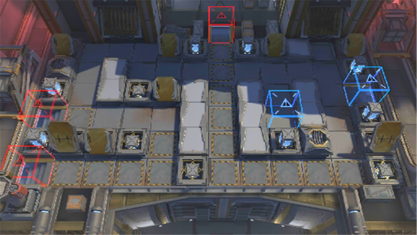

# 关卡一览————10-9

## 关卡一览

关卡编号: 10-9

关卡名称: 他乡故知

目标点生命值: 3

敌人总数: 27

理智消耗: 21

## 关卡地图

## 敌人情况

| 敌人图片 | 敌人名称 | 数量  |
|---------|-----|-----|
| ./eneIcons/eneIcons/´ó¾ýÖ®´¥.png| 大君之触  |   8  |
| ./eneIcons/eneIcons/´ó¾ýÖ®´Í.png| 大君之赐  |   0  |
| ./eneIcons/eneIcons/Èø¿¨×ÈÍõÍ¥¾üսʿ.png| 萨卡兹王庭军战士  |   9  |
| ./eneIcons/eneIcons/Èø¿¨×È×ÓÒá²¹¸ø³µ.png| 萨卡兹子裔补给车  |   6  |
| ./eneIcons/eneIcons/Èø¿¨×È×ÓÒáÁ´Êõʦ.png| 萨卡兹子裔链术师  |   4  |
