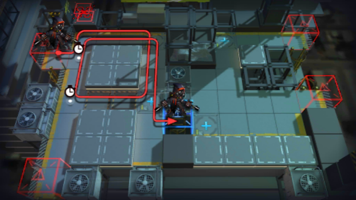

# 关卡一览————2-10

## 关卡一览

关卡编号: 2-10

关卡名称: 病入膏肓

目标点生命值: 3

敌人总数: 36

理智消耗: 15

## 关卡地图

## 敌人情况

| 敌人图片 | 敌人名称 | 数量  |
|---------|-----|-----|
| ./eneIcons/eneIcons/±©ÂÒ·Ö×Ó.png| 暴乱分子  |   6  |
| ./eneIcons/eneIcons/±©Í½.png| 暴徒  |   4  |
| ./eneIcons/eneIcons/·¥Ä¾»ú.png| 伐木机  |   2  |
| ./eneIcons/eneIcons/¸ß½×Êõʦ.png| 高阶术师  |   4  |
| ./eneIcons/eneIcons/¼¦Î²¾ÆͶÖÀÕß.png| 鸡尾酒投掷者  |   2  |
| ./eneIcons/eneIcons/Çá¼×ÎÀ±ø.png| 轻甲卫兵  |   4  |
| ./eneIcons/eneIcons/Ê°»ÄÕß.png| 拾荒者  |   3  |
| ./eneIcons/eneIcons/Ê¿±ø.png| 士兵  |   2  |
| ./eneIcons/eneIcons/Êõʦ.png| 术师  |   2  |
| ./eneIcons/eneIcons/Ëé¹Ç.png| 碎骨  |   1  |
| ./eneIcons/eneIcons/Óù4.png| 御4  |   3  |
| ./eneIcons/eneIcons/ÖØ×°·ÀÓùÕß.png| 重装防御者  |   3  |
