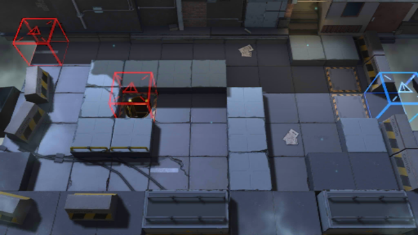

# 关卡一览————2-1

## 关卡一览

关卡编号: 2-1

关卡名称: 龙门之行

目标点生命值: 8

敌人总数: 50

理智消耗: 9

## 关卡地图

## 敌人情况

| 敌人图片 | 敌人名称 | 数量  |
|---------|-----|-----|
| ./eneIcons/eneIcons/±©Í½.png| 暴徒  |   12  |
| ./eneIcons/eneIcons/»ú¶¯¶Ü±ø.png| 机动盾兵  |   3  |
| ./eneIcons/eneIcons/¼¦Î²¾ÆͶÖÀÕß.png| 鸡尾酒投掷者  |   8  |
| ./eneIcons/eneIcons/ÁÔ¹·.png| 猎狗  |   12  |
| ./eneIcons/eneIcons/Ê¿±ø.png| 士兵  |   6  |
| ./eneIcons/eneIcons/Դʯ³æ¡¤¦Á.png| 源石虫·α  |   7  |
| ./eneIcons/eneIcons/ÖØ×°·ÀÓùÕß.png| 重装防御者  |   2  |
