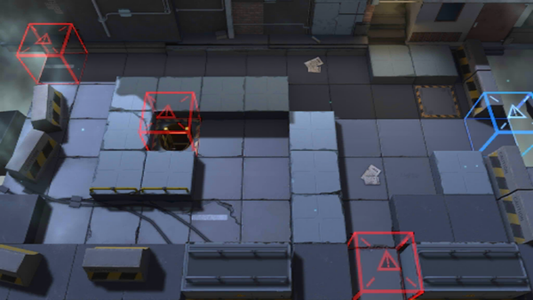

# 关卡一览————2-2

## 关卡一览

关卡编号: 2-2

关卡名称: 兵不接刃

目标点生命值: 5

敌人总数: 51

理智消耗: 9

## 关卡地图

## 敌人情况

| 敌人图片 | 敌人名称 | 数量  |
|---------|-----|-----|
| ./eneIcons/eneIcons/±©ÂÒ·Ö×Ó.png| 暴乱分子  |   13  |
| ./eneIcons/eneIcons/±©Í½.png| 暴徒  |   13  |
| ./eneIcons/eneIcons/»ú¶¯¶Ü±ø.png| 机动盾兵  |   2  |
| ./eneIcons/eneIcons/¼¦Î²¾ÆͶÖÀÕß.png| 鸡尾酒投掷者  |   3  |
| ./eneIcons/eneIcons/ÁÔ¹·.png| 猎狗  |   2  |
| ./eneIcons/eneIcons/åóÊÖ.png| 弩手  |   5  |
| ./eneIcons/eneIcons/Դʯ³æ¡¤¦Á.png| 源石虫·α  |   8  |
| ./eneIcons/eneIcons/ÖØ×°·ÀÓùÕß.png| 重装防御者  |   5  |
