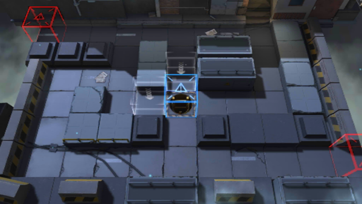

# 关卡一览————2-3

## 关卡一览

关卡编号: 2-3

关卡名称: 无罪推定

目标点生命值: 5

敌人总数: 52

理智消耗: 12

## 关卡地图

## 敌人情况

| 敌人图片 | 敌人名称 | 数量  |
|---------|-----|-----|
| ./eneIcons/eneIcons/±©ÂÒ·Ö×Ó.png| 暴乱分子  |   13  |
| ./eneIcons/eneIcons/·¥Ä¾»ú.png| 伐木机  |   3  |
| ./eneIcons/eneIcons/ÁÔ¹·pro.png| 猎狗pro  |   13  |
| ./eneIcons/eneIcons/åóÊÖ.png| 弩手  |   8  |
| ./eneIcons/eneIcons/Ê¿±ø.png| 士兵  |   10  |
| ./eneIcons/eneIcons/ÖØ×°·ÀÓùÕß.png| 重装防御者  |   5  |
