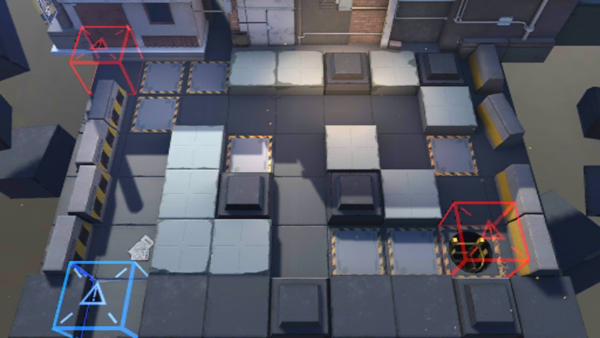

# 关卡一览————2-4

## 关卡一览

关卡编号: 2-4

关卡名称: 企鹅物流

目标点生命值: 5

敌人总数: 26

理智消耗: 12

## 关卡地图

## 敌人情况

| 敌人图片 | 敌人名称 | 数量  |
|---------|-----|-----|
| ./eneIcons/eneIcons/¸ß½×Êõʦ.png| 高阶术师  |   1  |
| ./eneIcons/eneIcons/»ú¶¯¶Ü±ø.png| 机动盾兵  |   5  |
| ./eneIcons/eneIcons/åóÊÖ.png| 弩手  |   3  |
| ./eneIcons/eneIcons/Ê¿±ø.png| 士兵  |   10  |
| ./eneIcons/eneIcons/Êõʦ.png| 术师  |   5  |
| ./eneIcons/eneIcons/Ë«³Ö½£Ê¿.png| 双持剑士  |   2  |
