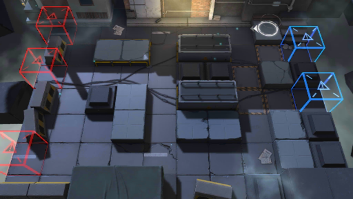

# 关卡一览————2-5

## 关卡一览

关卡编号: 2-5

关卡名称: 高空坠物

目标点生命值: 3

敌人总数: 40

理智消耗: 12

## 关卡地图

## 敌人情况

| 敌人图片 | 敌人名称 | 数量  |
|---------|-----|-----|
| ./eneIcons/eneIcons/·¥Ä¾»ú.png| 伐木机  |   2  |
| ./eneIcons/eneIcons/¸ß½×Êõʦ.png| 高阶术师  |   4  |
| ./eneIcons/eneIcons/ÁÔ¹·pro.png| 猎狗pro  |   8  |
| ./eneIcons/eneIcons/åóÊÖ.png| 弩手  |   5  |
| ./eneIcons/eneIcons/Ê¿±ø.png| 士兵  |   7  |
| ./eneIcons/eneIcons/Ë«³Ö½£Ê¿.png| 双持剑士  |   10  |
| ./eneIcons/eneIcons/Ë«³Ö½£Ê¿×鳤.png| 双持剑士组长  |   4  |
