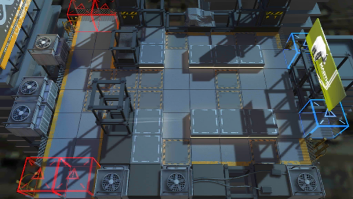

# 关卡一览————2-6

## 关卡一览

关卡编号: 2-6

关卡名称: 握紧扶手

目标点生命值: 5

敌人总数: 54

理智消耗: 12

## 关卡地图

## 敌人情况

| 敌人图片 | 敌人名称 | 数量  |
|---------|-----|-----|
| ./eneIcons/eneIcons/±©Í½.png| 暴徒  |   12  |
| ./eneIcons/eneIcons/¿Õ½µ±ø.png| 空降兵  |   18  |
| ./eneIcons/eneIcons/ÁÔ¹·.png| 猎狗  |   6  |
| ./eneIcons/eneIcons/åóÊÖ.png| 弩手  |   2  |
| ./eneIcons/eneIcons/åóÊÖ×鳤.png| 弩手组长  |   4  |
| ./eneIcons/eneIcons/Ê°»ÄÕß.png| 拾荒者  |   8  |
| ./eneIcons/eneIcons/Êõʦ.png| 术师  |   4  |
