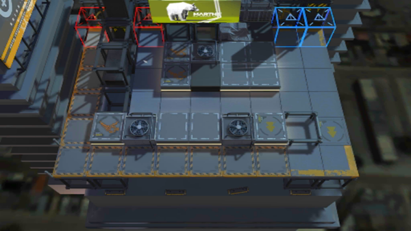

# 关卡一览————2-8

## 关卡一览

关卡编号: 2-8

关卡名称: 不做约定

目标点生命值: 3

敌人总数: 54

理智消耗: 12

## 关卡地图

## 敌人情况

| 敌人图片 | 敌人名称 | 数量  |
|---------|-----|-----|
| ./eneIcons/eneIcons/±©ÂÒ·Ö×Ó.png| 暴乱分子  |   11  |
| ./eneIcons/eneIcons/·¥Ä¾»ú.png| 伐木机  |   3  |
| ./eneIcons/eneIcons/¿Õ½µ±ø.png| 空降兵  |   10  |
| ./eneIcons/eneIcons/ÅÍз.png| 磐蟹  |   2  |
| ./eneIcons/eneIcons/ȼÉÕƿͶÖÀÕß.png| 燃烧瓶投掷者  |   3  |
| ./eneIcons/eneIcons/Ê¿±ø.png| 士兵  |   10  |
| ./eneIcons/eneIcons/Ñý¹Ö.png| 妖怪  |   12  |
| ./eneIcons/eneIcons/Óù4.png| 御4  |   3  |
