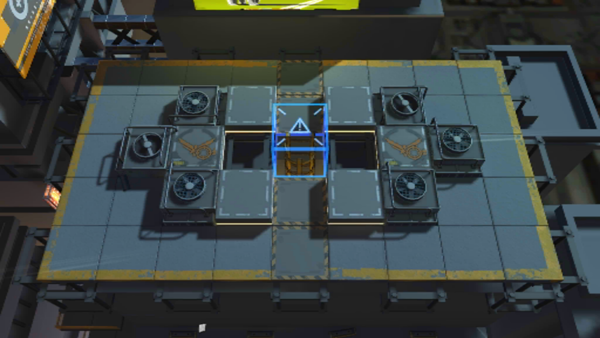

# 关卡一览————2-9

## 关卡一览

关卡编号: 2-9

关卡名称: 操作暗箱

目标点生命值: 3

敌人总数: 52

理智消耗: 12

## 关卡地图

## 敌人情况

| 敌人图片 | 敌人名称 | 数量  |
|---------|-----|-----|
| ./eneIcons/eneIcons/¿Õ½µ±ø.png| 空降兵  |   12  |
| ./eneIcons/eneIcons/¿Õ½µ×鳤.png| 空降组长  |   4  |
| ./eneIcons/eneIcons/Ñý¹Ö.png| 妖怪  |   26  |
| ./eneIcons/eneIcons/Ñý¹ÖMKII.png| 妖怪MKII  |   8  |
| ./eneIcons/eneIcons/Óù4.png| 御4  |   2  |
