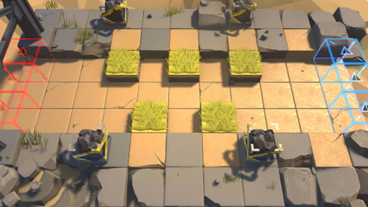

# 关卡一览————3-1

## 关卡一览

关卡编号: 3-1

关卡名称: 会合

目标点生命值: 3

敌人总数: 83

理智消耗: 15

## 关卡地图

## 敌人情况

| 敌人图片 | 敌人名称 | 数量  |
|---------|-----|-----|
| ./eneIcons/eneIcons/·¥Ä¾»ú.png| 伐木机  |   2  |
| ./eneIcons/eneIcons/¿ñ±©µÄÁÔ¹·pro.png| 狂暴的猎狗pro  |   9  |
| ./eneIcons/eneIcons/ÁÔ¹·pro.png| 猎狗pro  |   9  |
| ./eneIcons/eneIcons/åóÊÖ.png| 弩手  |   2  |
| ./eneIcons/eneIcons/åóÊÖ×鳤.png| 弩手组长  |   10  |
| ./eneIcons/eneIcons/DZ·üÕß.png| 潜伏者  |   13  |
| ./eneIcons/eneIcons/Êõʦ.png| 术师  |   9  |
| ./eneIcons/eneIcons/Ñý¹ÖMKII.png| 妖怪MKII  |   8  |
| ./eneIcons/eneIcons/Դʯ³æ¡¤¦Á.png| 源石虫·α  |   9  |
| ./eneIcons/eneIcons/Դʯ³æ¡¤¦Â.png| 源石虫·β  |   12  |
