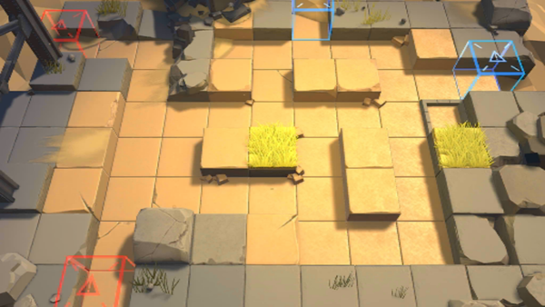

# 关卡一览————3-2

## 关卡一览

关卡编号: 3-2

关卡名称: 记忆

目标点生命值: 3

敌人总数: 67

理智消耗: 15

## 关卡地图

## 敌人情况

| 敌人图片 | 敌人名称 | 数量  |
|---------|-----|-----|
| ./eneIcons/eneIcons/±©ÂÒ·Ö×Ó.png| 暴乱分子  |   8  |
| ./eneIcons/eneIcons/»ú¶¯¶Ü±ø.png| 机动盾兵  |   3  |
| ./eneIcons/eneIcons/ÁÔ¹·pro.png| 猎狗pro  |   5  |
| ./eneIcons/eneIcons/åóÊÖ×鳤.png| 弩手组长  |   11  |
| ./eneIcons/eneIcons/DZ·üÕß.png| 潜伏者  |   20  |
| ./eneIcons/eneIcons/Ê°»ÄÕß.png| 拾荒者  |   2  |
| ./eneIcons/eneIcons/Դʯ³æ¡¤¦Á.png| 源石虫·α  |   6  |
| ./eneIcons/eneIcons/Դʯ³æ¡¤¦Â.png| 源石虫·β  |   12  |
