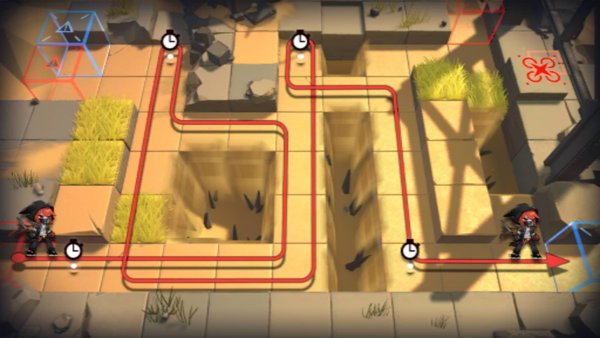

# 关卡一览————3-3

## 关卡一览

关卡编号: 3-3

关卡名称: 回旋

目标点生命值: 3

敌人总数: 50

理智消耗: 15

## 关卡地图

## 敌人情况

| 敌人图片 | 敌人名称 | 数量  |
|---------|-----|-----|
| ./eneIcons/eneIcons/±©Í½.png| 暴徒  |   8  |
| ./eneIcons/eneIcons/·¥Ä¾»ú.png| 伐木机  |   3  |
| ./eneIcons/eneIcons/·¥Ä¾ÀÏÊÖ.png| 伐木老手  |   1  |
| ./eneIcons/eneIcons/¼¼ÊõÕì²ì±ø.png| 技术侦察兵  |   2  |
| ./eneIcons/eneIcons/DZ·üÕß.png| 潜伏者  |   12  |
| ./eneIcons/eneIcons/Ê°»ÄÕß.png| 拾荒者  |   1  |
| ./eneIcons/eneIcons/Ê¿±ø.png| 士兵  |   4  |
| ./eneIcons/eneIcons/ß±¾ýÕß.png| 弑君者  |   1  |
| ./eneIcons/eneIcons/Ñý¹Ö.png| 妖怪  |   9  |
| ./eneIcons/eneIcons/ÒþÐÎåóÊÖ.png| 隐形弩手  |   9  |
