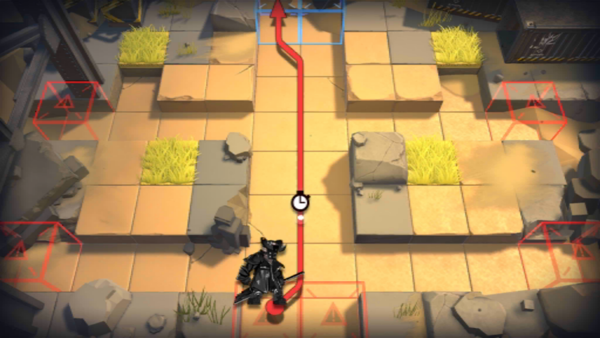

# 关卡一览————3-4

## 关卡一览

关卡编号: 3-4

关卡名称: 龟裂

目标点生命值: 3

敌人总数: 75

理智消耗: 15

## 关卡地图

## 敌人情况

| 敌人图片 | 敌人名称 | 数量  |
|---------|-----|-----|
| ./eneIcons/eneIcons/·¥Ä¾»ú.png| 伐木机  |   4  |
| ./eneIcons/eneIcons/Èø¿¨×È°Ù·ò³¤.png| 萨卡兹百夫长  |   1  |
| ./eneIcons/eneIcons/Ë«³Ö½£Ê¿.png| 双持剑士  |   12  |
| ./eneIcons/eneIcons/ÍÀ·ò.png| 屠夫  |   8  |
| ./eneIcons/eneIcons/Ñý¹ÖMKII.png| 妖怪MKII  |   22  |
| ./eneIcons/eneIcons/ÒþÐÎåóÊÖ.png| 隐形弩手  |   15  |
| ./eneIcons/eneIcons/Դʯ³æ¡¤¦Á.png| 源石虫·α  |   5  |
| ./eneIcons/eneIcons/Դʯ³æ¡¤¦Â.png| 源石虫·β  |   8  |
