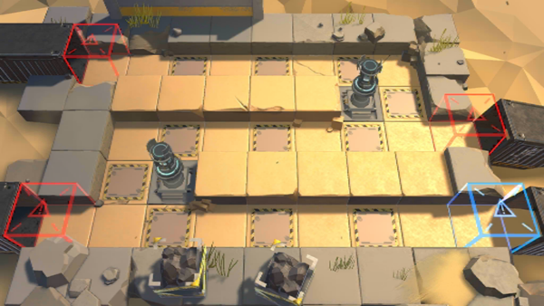

# 关卡一览————3-6

## 关卡一览

关卡编号: 3-6

关卡名称: 决定

目标点生命值: 3

敌人总数: 39

理智消耗: 15

## 关卡地图

## 敌人情况

| 敌人图片 | 敌人名称 | 数量  |
|---------|-----|-----|
| ./eneIcons/eneIcons/¿ñ±©µÄÁÔ¹·pro.png| 狂暴的猎狗pro  |   3  |
| ./eneIcons/eneIcons/DZ·üÕß.png| 潜伏者  |   24  |
| ./eneIcons/eneIcons/ÍÀ·ò.png| 屠夫  |   1  |
| ./eneIcons/eneIcons/ÍÀÔ×ÀÏÊÖ.png| 屠宰老手  |   1  |
| ./eneIcons/eneIcons/ÒþÐÎÊõʦ.png| 隐形术师  |   10  |
