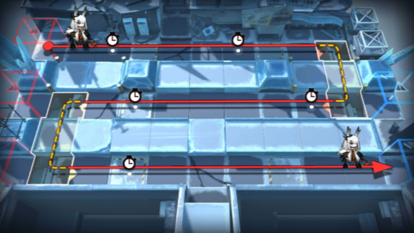

# 关卡一览————4-10

## 关卡一览

关卡编号: 4-10

关卡名称: 灯火将熄

目标点生命值: 3

敌人总数: 43

理智消耗: 21

## 关卡地图

## 敌人情况

| 敌人图片 | 敌人名称 | 数量  |
|---------|-----|-----|
| ./eneIcons/eneIcons/»ú¶¯¶Ü±ø.png| 机动盾兵  |   4  |
| ./eneIcons/eneIcons/È­ÈÐÎäÊ¿.png| 拳刃武士  |   9  |
| ./eneIcons/eneIcons/Ê¿±ø.png| 士兵  |   19  |
| ./eneIcons/eneIcons/Êõʦ×鳤.png| 术师组长  |   5  |
| ./eneIcons/eneIcons/˪ÐÇ.png| 霜星  |   1  |
| ./eneIcons/eneIcons/ÍÀ·ò.png| 屠夫  |   4  |
| ./eneIcons/eneIcons/ÖØ×°·ÀÓù×鳤.png| 重装防御组长  |   1  |
