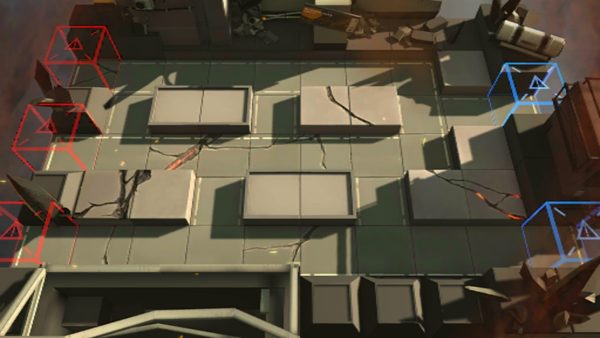

# 关卡一览————4-1

## 关卡一览

关卡编号: 4-1

关卡名称: 免费拥抱

目标点生命值: 5

敌人总数: 64

理智消耗: 18

## 关卡地图

## 敌人情况

| 敌人图片 | 敌人名称 | 数量  |
|---------|-----|-----|
| ./eneIcons/eneIcons/¿ñ±©µÄÁÔ¹·pro.png| 狂暴的猎狗pro  |   6  |
| ./eneIcons/eneIcons/ÁÔ¹·pro.png| 猎狗pro  |   9  |
| ./eneIcons/eneIcons/åóÊÖ×鳤.png| 弩手组长  |   8  |
| ./eneIcons/eneIcons/Èø¿¨×È´ó½£ÊÖ.png| 萨卡兹大剑手  |   4  |
| ./eneIcons/eneIcons/Ê¿±ø.png| 士兵  |   25  |
| ./eneIcons/eneIcons/Êõʦ×鳤.png| 术师组长  |   5  |
| ./eneIcons/eneIcons/Ñý¹Ö.png| 妖怪  |   7  |
