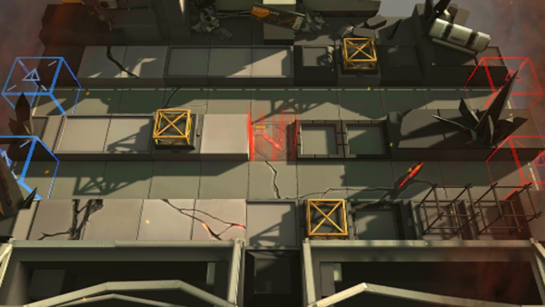

# 关卡一览————4-3

## 关卡一览

关卡编号: 4-3

关卡名称: 人工制冷

目标点生命值: 3

敌人总数: 53

理智消耗: 18

## 关卡地图

## 敌人情况

| 敌人图片 | 敌人名称 | 数量  |
|---------|-----|-----|
| ./eneIcons/eneIcons/¿ñ±©µÄÁÔ¹·pro.png| 狂暴的猎狗pro  |   8  |
| ./eneIcons/eneIcons/Çá¼×ÎÀ±ø×鳤.png| 轻甲卫兵组长  |   5  |
| ./eneIcons/eneIcons/Èø¿¨×È´ó½£ÊÖ.png| 萨卡兹大剑手  |   5  |
| ./eneIcons/eneIcons/Èø¿¨×Ⱦѻ÷ÊÖ.png| 萨卡兹狙击手  |   4  |
| ./eneIcons/eneIcons/Ê¿±ø.png| 士兵  |   29  |
| ./eneIcons/eneIcons/ÍÀ·ò.png| 屠夫  |   1  |
| ./eneIcons/eneIcons/Îä×°ÈËÔ±.png| 武装人员  |   1  |
