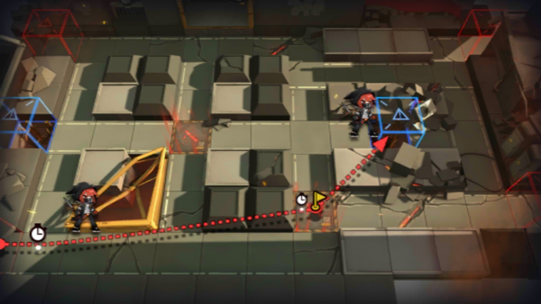

# 关卡一览————4-4

## 关卡一览

关卡编号: 4-4

关卡名称: 不要恐慌

目标点生命值: 3

敌人总数: 63

理智消耗: 18

## 关卡地图

## 敌人情况

| 敌人图片 | 敌人名称 | 数量  |
|---------|-----|-----|
| ./eneIcons/eneIcons/·¥Ä¾ÀÏÊÖ.png| 伐木老手  |   2  |
| ./eneIcons/eneIcons/Èø¿¨×È´ó½£ÊÖ.png| 萨卡兹大剑手  |   13  |
| ./eneIcons/eneIcons/Èø¿¨×Ⱦѻ÷ÊÖ.png| 萨卡兹狙击手  |   4  |
| ./eneIcons/eneIcons/Ê¿±ø.png| 士兵  |   43  |
| ./eneIcons/eneIcons/ß±¾ýÕß.png| 弑君者  |   1  |
