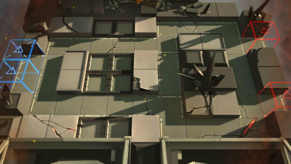

# 关卡一览————4-5

## 关卡一览

关卡编号: 4-5

关卡名称: 官僚主义

目标点生命值: 3

敌人总数: 40

理智消耗: 18

## 关卡地图

## 敌人情况

| 敌人图片 | 敌人名称 | 数量  |
|---------|-----|-----|
| ./eneIcons/eneIcons/·¨Êõ½üÎÀ.png| 法术近卫  |   10  |
| ./eneIcons/eneIcons/¿ñ±©µÄÁÔ¹·pro.png| 狂暴的猎狗pro  |   6  |
| ./eneIcons/eneIcons/Èø¿¨×È´ó½£ÊÖ.png| 萨卡兹大剑手  |   1  |
| ./eneIcons/eneIcons/Èø¿¨×Ⱦѻ÷ÊÖ.png| 萨卡兹狙击手  |   4  |
| ./eneIcons/eneIcons/Ë«³Ö½£Ê¿×鳤.png| 双持剑士组长  |   16  |
| ./eneIcons/eneIcons/ÍÀ·ò.png| 屠夫  |   3  |
