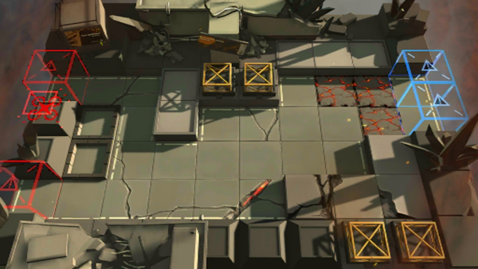

# 关卡一览————4-6

## 关卡一览

关卡编号: 4-6

关卡名称: 少见多怪

目标点生命值: 3

敌人总数: 55

理智消耗: 18

## 关卡地图

## 敌人情况

| 敌人图片 | 敌人名称 | 数量  |
|---------|-----|-----|
| ./eneIcons/eneIcons/±©ÂÒ·Ö×Ó.png| 暴乱分子  |   8  |
| ./eneIcons/eneIcons/·¨Êõ½üÎÀ.png| 法术近卫  |   14  |
| ./eneIcons/eneIcons/¸ßÄÜԴʯ³æ.png| 高能源石虫  |   6  |
| ./eneIcons/eneIcons/ȼÉÕƿͶÖÀÕß.png| 燃烧瓶投掷者  |   6  |
| ./eneIcons/eneIcons/Èø¿¨×È´ó½£ÊÖ.png| 萨卡兹大剑手  |   3  |
| ./eneIcons/eneIcons/Èø¿¨×Ⱦѻ÷ÊÖ.png| 萨卡兹狙击手  |   2  |
| ./eneIcons/eneIcons/Ê¿±ø.png| 士兵  |   9  |
| ./eneIcons/eneIcons/Ñý¹ÖMKII.png| 妖怪MKII  |   7  |
