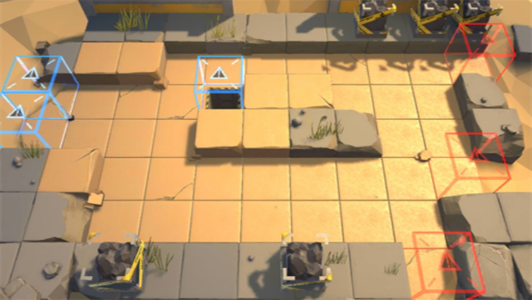

# 关卡一览————5-1

## 关卡一览

关卡编号: 5-1

关卡名称: 冤家易结

目标点生命值: 5

敌人总数: 43

理智消耗: 18

## 关卡地图

## 敌人情况

| 敌人图片 | 敌人名称 | 数量  |
|---------|-----|-----|
| ./eneIcons/eneIcons/·¥Ä¾»ú.png| 伐木机  |   2  |
| ./eneIcons/eneIcons/ÆÆÕóÕß.png| 破阵者  |   10  |
| ./eneIcons/eneIcons/ÌØսʿ±ø.png| 特战士兵  |   21  |
| ./eneIcons/eneIcons/ÌØÕ½Êõʦ.png| 特战术师  |   10  |
