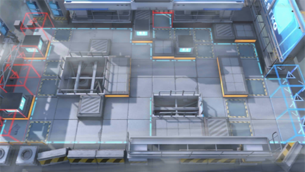

# 关卡一览————5-2

## 关卡一览

关卡编号: 5-2

关卡名称: 有口难言

目标点生命值: 3

敌人总数: 51

理智消耗: 18

## 关卡地图

## 敌人情况

| 敌人图片 | 敌人名称 | 数量  |
|---------|-----|-----|
| ./eneIcons/eneIcons/·¥Ä¾ÀÏÊÖ.png| 伐木老手  |   4  |
| ./eneIcons/eneIcons/¿ñ±©µÄÁÔ¹·pro.png| 狂暴的猎狗pro  |   5  |
| ./eneIcons/eneIcons/ÆÆÕóÕß.png| 破阵者  |   15  |
| ./eneIcons/eneIcons/ÌØսʿ±ø.png| 特战士兵  |   21  |
| ./eneIcons/eneIcons/ÌØÕ½Êõʦ.png| 特战术师  |   6  |
