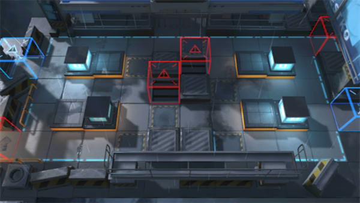

# 关卡一览————5-3

## 关卡一览

关卡编号: 5-3

关卡名称: 义胆凡躯

目标点生命值: 3

敌人总数: 52

理智消耗: 18

## 关卡地图

## 敌人情况

| 敌人图片 | 敌人名称 | 数量  |
|---------|-----|-----|
| ./eneIcons/eneIcons/·¥Ä¾ÀÏÊÖ.png| 伐木老手  |   2  |
| ./eneIcons/eneIcons/ÆÆÕóÕß.png| 破阵者  |   25  |
| ./eneIcons/eneIcons/ÆÆÕóÕß×鳤.png| 破阵者组长  |   15  |
| ./eneIcons/eneIcons/ÌØÕ½Êõʦ.png| 特战术师  |   6  |
| ./eneIcons/eneIcons/ÌØÕ½Êõʦ×鳤.png| 特战术师组长  |   4  |
