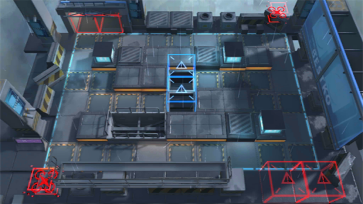

# 关卡一览————5-4

## 关卡一览

关卡编号: 5-4

关卡名称: 没人在家

目标点生命值: 3

敌人总数: 52

理智消耗: 18

## 关卡地图

## 敌人情况

| 敌人图片 | 敌人名称 | 数量  |
|---------|-----|-----|
| ./eneIcons/eneIcons/±©û_.png| 暴鸰  |   4  |
| ./eneIcons/eneIcons/ÆÆÕóÕß.png| 破阵者  |   16  |
| ./eneIcons/eneIcons/ÌØսʿ±ø.png| 特战士兵  |   14  |
| ./eneIcons/eneIcons/Ñý¹Ö.png| 妖怪  |   10  |
| ./eneIcons/eneIcons/Ñý¹ÖMKII.png| 妖怪MKII  |   8  |
