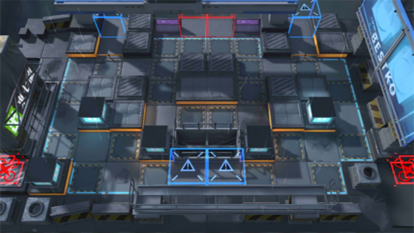

# 关卡一览————5-5

## 关卡一览

关卡编号: 5-5

关卡名称: 连绵战火

目标点生命值: 3

敌人总数: 56

理智消耗: 18

## 关卡地图

## 敌人情况

| 敌人图片 | 敌人名称 | 数量  |
|---------|-----|-----|
| ./eneIcons/eneIcons/±©û_¡¤G.png| 暴鸰·G  |   4  |
| ./eneIcons/eneIcons/·¥Ä¾ÀÏÊÖ.png| 伐木老手  |   6  |
| ./eneIcons/eneIcons/ÆÆÕóÕß.png| 破阵者  |   5  |
| ./eneIcons/eneIcons/ÆÆÕóÕß×鳤.png| 破阵者组长  |   10  |
| ./eneIcons/eneIcons/ÌØսʿ±ø.png| 特战士兵  |   9  |
| ./eneIcons/eneIcons/ÌØÕ½Êõʦ.png| 特战术师  |   6  |
| ./eneIcons/eneIcons/Ñý¹ÖMKII.png| 妖怪MKII  |   16  |
