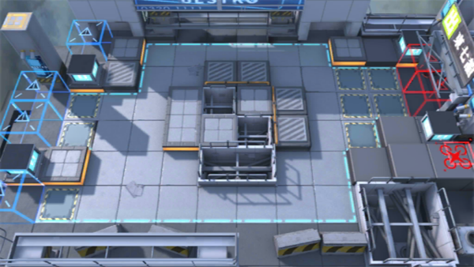

# 关卡一览————5-6

## 关卡一览

关卡编号: 5-6

关卡名称: 疑兵之计

目标点生命值: 3

敌人总数: 76

理智消耗: 18

## 关卡地图

## 敌人情况

| 敌人图片 | 敌人名称 | 数量  |
|---------|-----|-----|
| ./eneIcons/eneIcons/±©û_¡¤G.png| 暴鸰·G  |   4  |
| ./eneIcons/eneIcons/·¨Êõ´óʦA1.png| 法术大师A1  |   21  |
| ./eneIcons/eneIcons/ÆÆÕóÕß×鳤.png| 破阵者组长  |   8  |
| ./eneIcons/eneIcons/ÌØսʿ±ø.png| 特战士兵  |   9  |
| ./eneIcons/eneIcons/ÌØÕ½Êõʦ.png| 特战术师  |   6  |
| ./eneIcons/eneIcons/ÍÀ·ò.png| 屠夫  |   8  |
| ./eneIcons/eneIcons/Դʯ³æ¡¤¦Â.png| 源石虫·β  |   20  |
