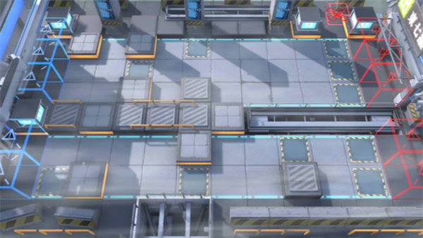

# 关卡一览————5-7

## 关卡一览

关卡编号: 5-7

关卡名称: 生死与共

目标点生命值: 3

敌人总数: 91

理智消耗: 21

## 关卡地图

## 敌人情况

| 敌人图片 | 敌人名称 | 数量  |
|---------|-----|-----|
| ./eneIcons/eneIcons/·¨Êõ´óʦA1.png| 法术大师A1  |   18  |
| ./eneIcons/eneIcons/º®Ëª.png| 寒霜  |   3  |
| ./eneIcons/eneIcons/ÆÆÕóÕß.png| 破阵者  |   11  |
| ./eneIcons/eneIcons/Çá¼×ÎÀ±ø×鳤.png| 轻甲卫兵组长  |   6  |
| ./eneIcons/eneIcons/ÌØսʿ±ø.png| 特战士兵  |   14  |
| ./eneIcons/eneIcons/ÍÀÔ×ÀÏÊÖ.png| 屠宰老手  |   3  |
| ./eneIcons/eneIcons/Դʯ³æ¡¤¦Â.png| 源石虫·β  |   36  |
