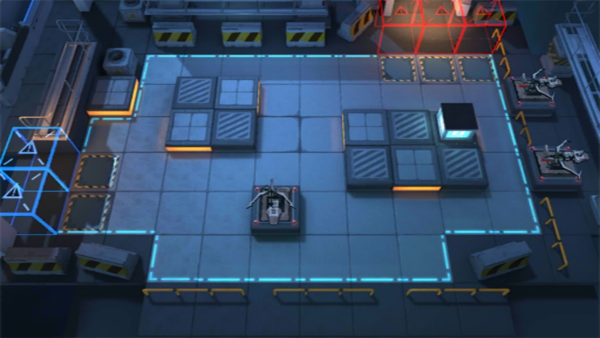

# 关卡一览————5-8

## 关卡一览

关卡编号: 5-8

关卡名称: 了如指掌

目标点生命值: 3

敌人总数: 53

理智消耗: 18

## 关卡地图

## 敌人情况

| 敌人图片 | 敌人名称 | 数量  |
|---------|-----|-----|
| ./eneIcons/eneIcons/ÆÆÕóÕß.png| 破阵者  |   11  |
| ./eneIcons/eneIcons/Ê°»ÄÕß.png| 拾荒者  |   7  |
| ./eneIcons/eneIcons/ËÞÖ÷Ê¿±ø.png| 宿主士兵  |   8  |
| ./eneIcons/eneIcons/ÌØսʿ±ø.png| 特战士兵  |   24  |
| ./eneIcons/eneIcons/ÍÀÔ×ÀÏÊÖ.png| 屠宰老手  |   3  |
