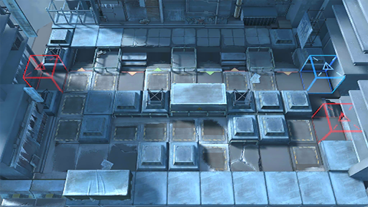

# 关卡一览————6-10

## 关卡一览

关卡编号: 6-10

关卡名称: 解开铃铛

目标点生命值: 3

敌人总数: 41

理智消耗: 18

## 关卡地图

## 敌人情况

| 敌人图片 | 敌人名称 | 数量  |
|---------|-----|-----|
| ./eneIcons/eneIcons/±ù±¬Ô´Ê¯³æ.png| 冰爆源石虫  |   15  |
| ./eneIcons/eneIcons/˪ÑÀ.png| 霜牙  |   12  |
| ./eneIcons/eneIcons/Ñ©¹ÖÊõʦ.png| 雪怪术师  |   4  |
| ./eneIcons/eneIcons/Ñ©¹ÖС¶Ó.png| 雪怪小队  |   9  |
| ./eneIcons/eneIcons/Ñ©¹ÖС¶ÓÔä±ùÈË.png| 雪怪小队凿冰人  |   1  |
