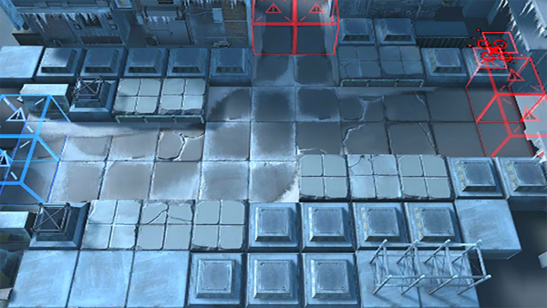

# 关卡一览————6-11

## 关卡一览

关卡编号: 6-11

关卡名称: “这种事”

目标点生命值: 3

敌人总数: 79

理智消耗: 21

## 关卡地图

## 敌人情况

| 敌人图片 | 敌人名称 | 数量  |
|---------|-----|-----|
| ./eneIcons/eneIcons/±ù±¬Ô´Ê¯³æ.png| 冰爆源石虫  |   21  |
| ./eneIcons/eneIcons/º®Ëª.png| 寒霜  |   1  |
| ./eneIcons/eneIcons/Çá¼×ÎÀ±ø×鳤.png| 轻甲卫兵组长  |   9  |
| ./eneIcons/eneIcons/˪Èñ.png| 霜锐  |   12  |
| ./eneIcons/eneIcons/˪ÑÀ.png| 霜牙  |   9  |
| ./eneIcons/eneIcons/Ñ©¹ÖÊõʦ.png| 雪怪术师  |   4  |
| ./eneIcons/eneIcons/Ñ©¹ÖÊõʦ×鳤.png| 雪怪术师组长  |   4  |
| ./eneIcons/eneIcons/Ñ©¹ÖС¶Ó.png| 雪怪小队  |   17  |
| ./eneIcons/eneIcons/Ñ©¹ÖС¶ÓÔä±ùÈË.png| 雪怪小队凿冰人  |   2  |
