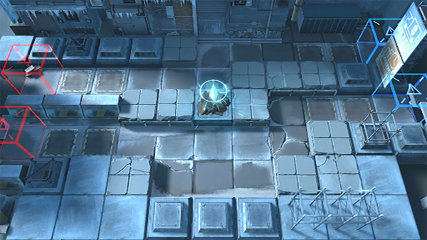

# 关卡一览————6-12

## 关卡一览

关卡编号: 6-12

关卡名称: 冰原之雪

目标点生命值: 3

敌人总数: 76

理智消耗: 18

## 关卡地图

## 敌人情况

| 敌人图片 | 敌人名称 | 数量  |
|---------|-----|-----|
| ./eneIcons/eneIcons/±ù±¬Ô´Ê¯³æ.png| 冰爆源石虫  |   21  |
| ./eneIcons/eneIcons/˪ÑÀ.png| 霜牙  |   14  |
| ./eneIcons/eneIcons/Ñ©¹ÖÊõʦ.png| 雪怪术师  |   6  |
| ./eneIcons/eneIcons/Դʯ³æ¡¤¦Â.png| 源石虫·β  |   35  |
