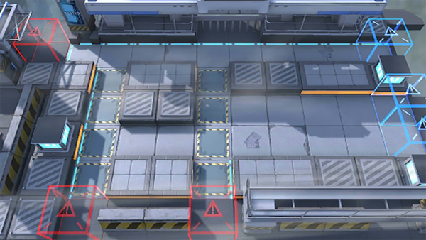

# 关卡一览————6-1

## 关卡一览

关卡编号: 6-1

关卡名称: 僵局

目标点生命值: 5

敌人总数: 46

理智消耗: 18

## 关卡地图

## 敌人情况

| 敌人图片 | 敌人名称 | 数量  |
|---------|-----|-----|
| ./eneIcons/eneIcons/ËÞÖ÷Ê°»ÄÕß.png| 宿主拾荒者  |   4  |
| ./eneIcons/eneIcons/ËÞÖ÷Ê¿±ø.png| 宿主士兵  |   8  |
| ./eneIcons/eneIcons/ËÞÖ÷Ê¿±ø×鳤.png| 宿主士兵组长  |   9  |
| ./eneIcons/eneIcons/ËÞÖ÷ÖØ×°Ê¿±ø.png| 宿主重装士兵  |   1  |
| ./eneIcons/eneIcons/ÌØսʿ±ø.png| 特战士兵  |   12  |
| ./eneIcons/eneIcons/ÌØÕ½Êõʦ.png| 特战术师  |   12  |
