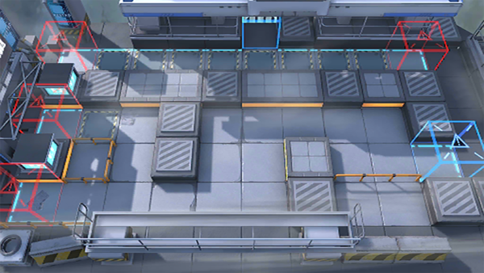

# 关卡一览————6-5

## 关卡一览

关卡编号: 6-5

关卡名称: 解决谁？

目标点生命值: 3

敌人总数: 42

理智消耗: 18

## 关卡地图

## 敌人情况

| 敌人图片 | 敌人名称 | 数量  |
|---------|-----|-----|
| ./eneIcons/eneIcons/¿ñ±©ËÞÖ÷Ê¿±ø.png| 狂暴宿主士兵  |   3  |
| ./eneIcons/eneIcons/¿ñ±©ËÞÖ÷ͶÖÀÊÖ.png| 狂暴宿主投掷手  |   7  |
| ./eneIcons/eneIcons/¿ñ±©ËÞÖ÷ÖÀ¹ÇÊÖ.png| 狂暴宿主掷骨手  |   1  |
| ./eneIcons/eneIcons/¿ñ±©ËÞÖ÷×鳤.png| 狂暴宿主组长  |   2  |
| ./eneIcons/eneIcons/ËÞÖ÷Ê¿±ø.png| 宿主士兵  |   24  |
| ./eneIcons/eneIcons/ËÞÖ÷ÖØ×°Ê¿±ø.png| 宿主重装士兵  |   5  |
