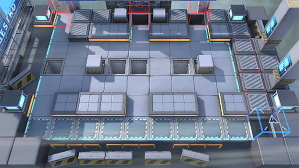

# 关卡一览————6-7

## 关卡一览

关卡编号: 6-7

关卡名称: 断弦

目标点生命值: 20

敌人总数: 45

理智消耗: 0

## 关卡地图

## 敌人情况

| 敌人图片 | 敌人名称 | 数量  |
|---------|-----|-----|
| ./eneIcons/eneIcons/¸¡Ê¿µÂ.png| 浮士德  |   1  |
| ./eneIcons/eneIcons/¿ñ±©ËÞÖ÷Ê¿±ø.png| 狂暴宿主士兵  |   4  |
| ./eneIcons/eneIcons/¿ñ±©ËÞÖ÷ͶÖÀÊÖ.png| 狂暴宿主投掷手  |   4  |
| ./eneIcons/eneIcons/ËÞÖ÷Ê°»ÄÕß.png| 宿主拾荒者  |   8  |
| ./eneIcons/eneIcons/ËÞÖ÷Ê¿±ø.png| 宿主士兵  |   28  |
