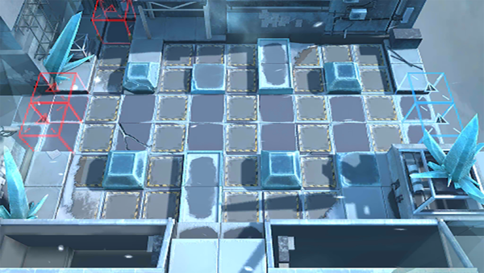

# 关卡一览————6-8

## 关卡一览

关卡编号: 6-8

关卡名称: 只是从天而降！

目标点生命值: 3

敌人总数: 36

理智消耗: 18

## 关卡地图

## 敌人情况

| 敌人图片 | 敌人名称 | 数量  |
|---------|-----|-----|
| ./eneIcons/eneIcons/˪ÑÀ.png| 霜牙  |   14  |
| ./eneIcons/eneIcons/Ñ©¹Ö¾Ñ»÷ÊÖ.png| 雪怪狙击手  |   8  |
| ./eneIcons/eneIcons/Ñ©¹ÖС¶Ó.png| 雪怪小队  |   14  |
