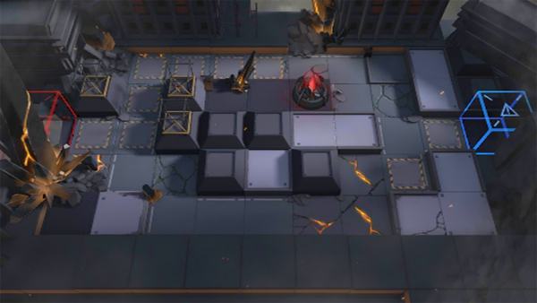

# 关卡一览————7-10

## 关卡一览

关卡编号: 7-10

关卡名称: 暗淡者之火

目标点生命值: 3

敌人总数: 41

理智消耗: 18

## 关卡地图

## 敌人情况

| 敌人图片 | 敌人名称 | 数量  |
|---------|-----|-----|
| ./eneIcons/eneIcons/¹ÍÓ¶¾üÈø¿¨×Èսʿ.png| 雇佣军萨卡兹战士  |   10  |
| ./eneIcons/eneIcons/Óλ÷¶ÓÁÔÈ®.png| 游击队猎犬  |   7  |
| ./eneIcons/eneIcons/Óλ÷¶Óսʿ.png| 游击队战士  |   24  |
